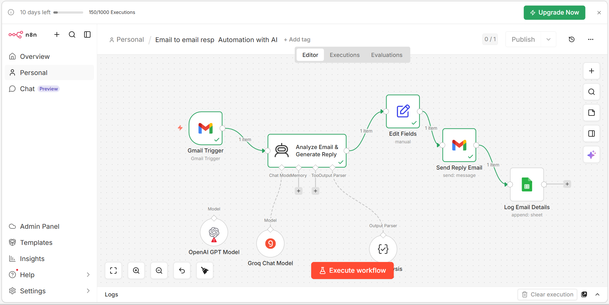

# email-auto-reply-automation-
AI-based email auto-reply system using n8n and Groq

# Email Auto Reply Automation 🚀

This project automates email responses using AI and n8n.

## Features

- ✅ Reads incoming emails (Gmail)
- ✅ Uses AI (Groq) to analyze content
- ✅ Generates professional reply automatically
- ✅ Sends reply email instantly
- ✅ Logs email details in Google Sheets

## Workflow

Email → AI Analysis → Generate Reply  
→ Send Email → Save to Google Sheet  

## Workflow Screenshot

> Below is the full n8n automation workflow:

## Tech Stack

- n8n
- Groq LLM
- Gmail API
- Google Sheets API

## How to Use

1. Import workflow JSON into n8n
2. Add credentials:
   - Gmail
   - Groq API
   - Google Sheets
3. Activate workflow
4. Send email → auto reply sent

## Output

- Automated email replies
- Log of emails in Google Sheets

---

Built for automation learning 🚀
``
